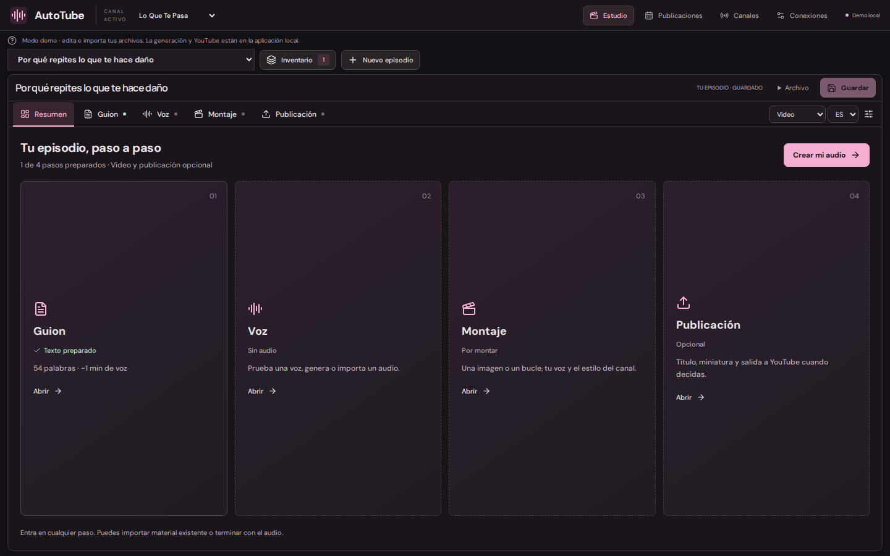
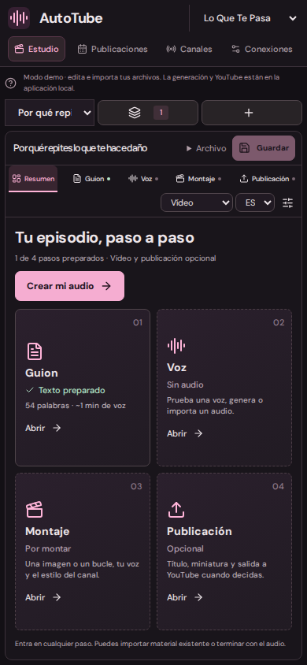
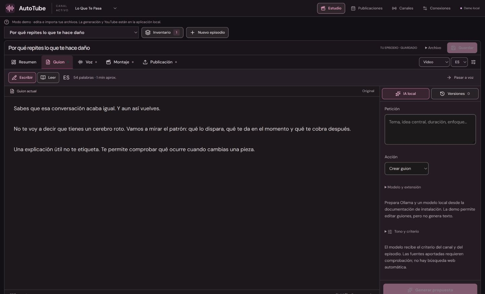

# AutoTube · Showcase

**Guion → voz → montaje → preparación de publicación, en una misma mesa.** AutoTube es mi proyecto de escritorio para producir episodios y organizar varios canales de YouTube. Cada canal conserva su identidad y criterio editorial; cada episodio puede ajustar el tono, las fuentes y el idioma. — **Calin Rus**

React + Tauri · motor local Python · SQLite · MCP. **Lo Que Te Pasa** es el primer espacio editorial configurado; el producto admite otros canales y criterios.

Este repositorio público contiene la demo interactiva de la interfaz y documentación seleccionada. El motor, el uploader y el empaquetado completos se mantienen en un repositorio privado. La demo no publica vídeos ni genera audio con proveedores.



## Diseño y flujo

El editor **0.4.2** muestra el estado de Guion, Voz, Montaje y Publicación. La cinta de herramientas mantiene las acciones a mano; documentos, listas e inspectores se desplazan dentro de sus paneles. El inventario y el archivo del episodio se despliegan sobre la mesa. Mantiene el tema rosa oscuro y se adapta a pantallas estrechas.

- Guion con escritura, lectura y versiones que se revisan antes de aplicar.
- Historial de audios por idioma: filtros de muestras/completas, elección y descarte reversible.
- Montaje con herramientas, visor y secuencia de intro, contenido y cierre.
- Foto o vídeo en bucle como fondo, separado de la miniatura de YouTube.
- Identidad y criterio por canal, con ajustes por episodio.
- Inventario, calendario y preparación de publicación.
- **Solo audio:** revisar y guardar una toma sin pasar por montaje ni YouTube.
- Conexiones separadas en Voces e IA, YouTube y MCP.

## Un episodio, paso a paso

1. **Guion:** escribe o importa el texto, añade fuentes y aplica el criterio del canal. En la aplicación de escritorio, Ollama puede proponer versiones que revisas antes de usar.
2. **Voz:** prueba una muestra, escucha el historial por idioma y elige una toma completa. Puedes importar audio existente o terminar aquí con **Solo audio**.
3. **Montaje:** combina la narración con una foto, un título o un vídeo en bucle; añade intro y cierre del canal. La aplicación de escritorio exporta MP4 horizontal o vertical con FFmpeg.
4. **Publicación:** prepara título, descripción, miniatura y calendario. La integración de escritorio utiliza OAuth por canal y subida reanudable; falta validar una subida a una cuenta real de YouTube.

La demo permite crear canales/episodios, editar y guardar, añadir idiomas, importar y reproducir medios y guardar un archivo importado. Usa `localStorage`; la generación de texto/voz y la creación de un MP4 corresponden a la aplicación privada. No importes datos sensibles ni claves en esta demo.

<details>
<summary>Vista móvil de la demo</summary>



</details>

<details>
<summary>Editor de guion de la demo</summary>



</details>

## Probar

```bash
npm ci
npm run dev
```

Abre http://127.0.0.1:1420.

```bash
npm run verify
```

## Implementación de escritorio

La versión privada incluye SQLite, revisiones, cola serial, OAuth por canal, subida reanudable, calendario `publishAt`, miniaturas, FFmpeg, exportación de recursos y MCP stdio. Generación de texto con Ollama; voz local con Qwen3-TTS y adaptadores opcionales de ElevenLabs/Chatterbox.

La integración de YouTube se ha probado con HTTP simulado, el render con FFmpeg real y MCP con cliente stdio real. Se han generado texto y voz locales y exportado una secuencia real con el motor empaquetado. La interfaz actual se ha comprobado en navegador; la inspección visual nativa del escritorio empaquetado sigue pendiente. No se han subido vídeos a una cuenta real ni realizado una comparación acústica controlada. El audio alternativo de un mismo vídeo requiere carga manual en Studio. Un proyecto de API sin auditoría puede limitar las subidas a privado. [Evidencia y límites](docs/VALIDACION.md).

## Documentación seleccionada

- [Editor local: guion, revisión y montaje](docs/EDITOR.md)
- [Producto y límites](docs/PRODUCTO.md)
- [Arquitectura](docs/ARQUITECTURA.md)
- [Audio y alternativas locales](docs/AUDIO.md)
- [YouTube y programación](docs/YOUTUBE.md)
- [MCP y contexto editorial](docs/MCP.md)
- [Criterio de Lo Que Te Pasa](docs/EDITORIAL.md)
- [Evidencia de validación](docs/VALIDACION.md)

El showcase no incluye credenciales, estadísticas privadas de canales, guiones de producción ni el almacén del usuario. Código publicado para mostrar el trabajo; no se concede una licencia adicional de uso o redistribución.
