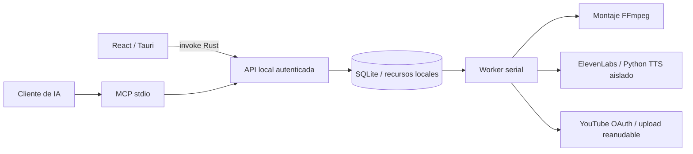

# Arquitectura

## Componentes

- `src/`: React, tipos compartidos de producto y bridge. El navegador usa un almacén de demo independiente.
- `src-tauri/`: launcher del motor, puente HTTP y selector de archivos. No expone un comando de shell arbitrario al frontend.
- `engine/autotube/store.py`: SQLite, recursos por ID, revisiones y jobs.
- `service.py`: whitelist de operaciones, validación y transacciones de calendario.
- `worker.py`: ejecución serial, persistencia de resultados y asociación de medios.
- `youtube.py`: OAuth por canal, uploader, miniatura y listado remoto.
- `voice.py` + `local_tts.py`: proveedores de voz y proceso aislado.
- `mcp_server.py`: tools stdio hacia el mismo motor.

## Datos y contratos

Un canal tiene ID interno, ID remoto opcional, idiomas, zona horaria y perfil editorial. Un proyecto tiene una revisión, referencia de canal, guion, fuentes, SEO, flags de público infantil/contenido sintético y tracks.

Una pista tiene idioma, guion, proveedor, voz, recurso de audio, MP4 localizado opcional y metadatos. El MP4 principal queda en `project.video_id`; montar otro idioma guarda su MP4 en la pista, sin sobrescribir el principal.

Los archivos se copian al almacén administrado, se identifican por UUID y registran un SHA-256. El uploader comprueba el hash antes de enviar el vídeo. La exportación incluye el contexto y los medios; excluye llavero, token local y sesiones de subida.

## Concurrencia

SQLite usa WAL y transacciones `BEGIN IMMEDIATE` para reclamar jobs y encolar lotes. La revisión del proyecto evita sobrescribir una edición hecha desde otro cliente. Los proyectos con jobs activos se bloquean para editar; cada job guarda una instantánea inmutable. Un filelock impide dos workers sobre el mismo almacén.

Estados: `queued` → `running` → `done`; errores de producción → `failed`; errores o interrupciones de subida → `needs_review`; cancelación de un job no iniciado → `cancelled`.

El worker que arranca después de una interrupción mueve los jobs `running` a revisión. No reproduce automáticamente una operación de publicación incierta.

## Transporte y secretos

API enlazada únicamente a `127.0.0.1:47831`. Cada comando requiere un token local, generado con permisos 0600; directorio de datos 0700 en POSIX. No hay CORS de acceso público. El healthcheck solo identifica el servicio y la versión.

Tokens OAuth y clave ElevenLabs viven en el llavero del sistema. Un llavero no disponible hace fallar la operación; no hay fallback a un JSON sin cifrar. Las URLs de sesión reanudable se guardan en SQLite para recuperarlas pero no aparecen en snapshots ni herramientas MCP. Los errores de red se sustituyen por mensajes sin credenciales ni URL de sesión.

El MCP stdio es un puente local. Para clientes cloud hace falta una conexión desktop compatible o desplegar una variante remota autenticada. No se abre un túnel ni se expone la API local en esta entrega.
